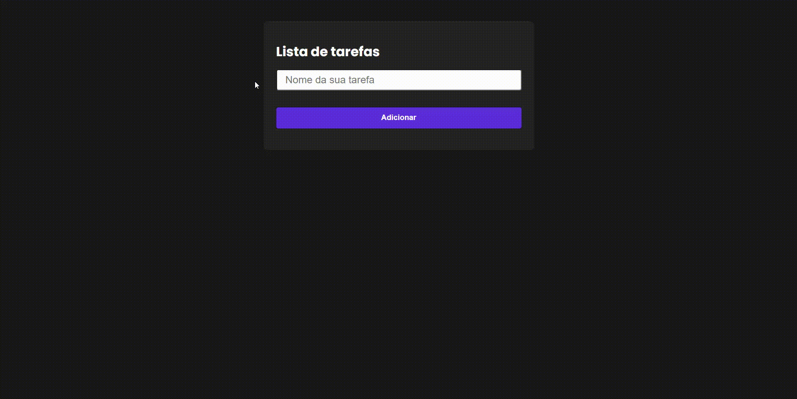

# Organize suas tarefas!

#### Aplicação de todo-list desenvolvida a partir das instruções do curso ["Curso de JavaScript e TypeScript do básico ao avançado 2021"](https://www.udemy.com/course/curso-de-javascript-moderno-do-basico-ao-avancado/) do [Luiz Otávio Miranda](https://github.com/luizomf)

---
# Preview:

### Utilizo as ferramentas:
- JavaScript
- HTML5
- CSS
